# 🐘 Awesome PostgreSQL Monitoring 📊

[](https://github.com/ishandutta2007/Awesome-Awesome-Awesome)<a href="https://discord.gg/jc4xtF58Ve"></a> [](https://www.postgresql.org/) [](LICENSE) <a href="https://github.com/ishandutta2007"></a>



> 🚀 **The Ultimate Curated Guide to PostgreSQL Database Monitoring, Query Performance Analytics, EXPLAIN Insights, & Health Observability Solutions.**

---

## 📌 Table of Contents

- [💡 Market Overview & Sector Landscape](#-market-overview--sector-landscape)
- [☁️ SaaS & Hosted Monitoring Platforms](#️-saas--hosted-monitoring-platforms)
- [⚡ Open-Source GitHub Projects](#-open-source-github-projects)
- [🛠️ Architecture & Best Practices](#️-architecture--best-practices)
- [🤝 How to Contribute](#-how-to-contribute)
- [☕ Support & Sponsorship](#-support--sponsorship)
- [📈 Star History](#-star-history)
- [⚠️ Disclaimer](#️-disclaimer)

---

## 💡 Market Overview & Sector Landscape

The global database performance monitoring and observability market is estimated at **$5.2 Billion - $7.8 Billion USD**, growing at a **18.5% CAGR**. 

The sector is **moderately fragmented** — dominated at the enterprise infrastructure layer by full-stack observability giants (Datadog, New Relic, IBM Instana), while simultaneously supporting specialized, high-margin PostgreSQL performance tools (pganalyze, Postgres.ai) and a thriving, self-hosted open-source ecosystem (Patroni, pgHero, pgwatch).

---

## ☁️ SaaS & Hosted Monitoring Platforms

Below is a detailed comparison of top commercial and managed PostgreSQL monitoring solutions, sorted by **Company Size / Annual Revenue / Valuation (Descending)**:

| Platform | Company Size / Revenue / Valuation | Description | Starting Price | Free Tier Limits |
| :--- | :--- | :--- | :--- | :--- |
| **[Datadog Database Monitoring](https://www.datadoghq.com/product/database-monitoring/)** 🐶 | **~$3.97 Billion ARR** / $45B+ Market Cap | Enterprise-grade observability suite providing deep PostgreSQL query metrics, query execution samples, EXPLAIN plans, and APM trace correlation. | $70/database host/month (billed annually) | 14-day free trial |
| **[New Relic Database](https://newrelic.com/)** 📊 | **~$1.0 Billion Revenue** / $6.5 Billion Acquisition | Comprehensive database monitoring capabilities within New Relic’s full-stack observability platform for PostgreSQL and multi-cloud DBs. | $0.40/GB for data ingest over free tier | Free forever plan with 100 GB/month data ingest & 1 full user |
| **[Instana (IBM)](https://www.ibm.com/products/instana)** 🤖 | **IBM Enterprise Division** (~$62B IBM Rev) | Enterprise automated application performance monitoring and database health visibility with automatic discovery for PostgreSQL. | $21.20/Managed Virtual Server (MVS)/month | 14-day free trial |
| **[Checkmk](https://checkmk.com/)** 🔍 | **>€300 Million Valuation** (~€30M ARR) | Infrastructure and database monitoring platform with automated PostgreSQL service checks, query latency monitoring, and alerting. | €30/month (Cloud/Managed starting tier) | Enterprise Free Edition limited to 25 hosts (or Community Edition free forever) |
| **[Redgate Monitor](https://www.red-gate.com/products/dba/sql-monitor/)** 🛡️ | **~$100 Million ARR** | Enterprise database monitoring solution designed for DBAs managing PostgreSQL and SQL Server estates at scale. | $1,164/server/year (~$97/month) | 14-day free trial |
| **[Sematext](https://sematext.com/)** 🌐 | **$1 Million - $10 Million ARR** (Estimated) | All-in-one DevOps observability platform offering PostgreSQL performance metrics, log analytics, and custom dashboards. | $2.80/host/month (Infrastructure monitoring) | Free plan up to 5 hosts (30-minute data retention) / 14-day trial |
| **[pganalyze](https://pganalyze.com/)** 🐘 | **~$880,000 ARR** (Bootstrapped/Private) | Specialized PostgreSQL query performance platform with automated EXPLAIN analysis, Index Advisor, and schema insights. | $149/month (Production plan, 1 DB server) | 14-day free trial |
| **[Postgres.ai](https://postgres.ai/)** 🧪 | **~$550,000 ARR** (Bootstrapped/Private) | Database branching, thin cloning (DBLab Engine), and query optimization tooling to accelerate PostgreSQL testing and performance tuning. | $62/month (Standard Edition / DBLab SE) | Free open-source Community Edition (self-hosted) |
| **[ClusterControl (Severalnines)](https://severalnines.com/)** ⚙️ | **Private / VC Funded** | High-availability database deployment, management, backup automation, and cluster monitoring platform for PostgreSQL. | €250/node/month (Advanced Self-Serve) | Free forever Community Edition (or 30-day Enterprise free trial) |

---

## ⚡ Open-Source GitHub Projects

The self-hosted PostgreSQL ecosystem features world-class open-source projects. Sorted by **GitHub Star Count (Descending)**:

- **[pgHero](https://github.com/ankane/pghero)** [](https://github.com/ankane/pghero/stargazers) 🦸  
  Simple, practical open-source performance dashboard for PostgreSQL that highlights slow queries, unused indexes, vacuum health, and active connections.

- **[Patroni](https://github.com/zalando/patroni)** [](https://github.com/zalando/patroni/stargazers) 👔  
  Template for PostgreSQL High Availability using ZooKeeper, etcd, or Consul with integrated health monitoring and automatic failover.

- **[pgBadger](https://github.com/darold/pgbadger)** [](https://github.com/darold/pgbadger/stargazers) 🦡  
  Fast, parallel PostgreSQL log analyzer that generates comprehensive HTML reports from server logs for workload analysis and query audit.

- **[postgres_exporter](https://github.com/prometheus-community/postgres_exporter)** [](https://github.com/prometheus-community/postgres_exporter/stargazers) 📡  
  Official Prometheus exporter for PostgreSQL server metrics, enabling seamless metrics collection and Grafana dashboard visualization.

- **[Percona Monitoring and Management (PMM)](https://github.com/percona/pmm)** [](https://github.com/percona/pmm/stargazers) 📈  
  Comprehensive, fully open-source database monitoring platform featuring Query Analytics (QAN), system metrics dashboards, and performance advisors.

- **[pgwatch / pgwatch2](https://github.com/cybertec-postgresql/pgwatch)** [](https://github.com/cybertec-postgresql/pgwatch/stargazers) ⌚  
  Flexible, non-intrusive PostgreSQL metrics collector and dashboarding tool with out-of-the-box Grafana dashboards and multiple backend options.

- **[PoWA (PostgreSQL Workload Analyzer)](https://github.com/powa-team/powa)** [](https://github.com/powa-team/powa/stargazers) 🔬  
  Real-time performance analysis extension and GUI that captures and aggregates workload statistics (`pg_stat_statements`, `pg_qualstats`, `pg_stat_kcache`).

- **[pg_stat_monitor](https://github.com/percona/pg_stat_monitor)** [](https://github.com/percona/pg_stat_monitor/stargazers) 🕵️  
  Advanced query performance stats collector extension by Percona providing time-bucketed metrics, query plan capturing, and histogram distribution.

- **[pg_stat_statements](https://www.postgresql.org/docs/current/pgstatstatements.html)** 📑  
  Built-in core PostgreSQL module that tracks execution statistics of all SQL statements — the foundational engine powering almost all monitoring tools.

---

## 🛠️ Architecture & Best Practices

For production PostgreSQL deployments, a recommended open-source monitoring pipeline includes:

```
[PostgreSQL Database] 
   ├── pg_stat_statements (Core Query Telemetry)
   ├── postgres_exporter ────► [Prometheus TSDB] ────► [Grafana Dashboards]
   ├── pgBadger ─────────────► [HTML Log Reports]
   └── pgHero / PoWA ────────► [Real-time DBA Diagnostics & Index Advisory]
```

1. **Enable `pg_stat_statements`** in `postgresql.conf` for essential baseline query tracking.
2. **Deploy `postgres_exporter` + Prometheus + Grafana** for infrastructure and engine-level metrics.
3. **Use `pgHero` or `PoWA`** for instant query performance and missing index insights.
4. **Schedule `pgBadger`** for nightly log-based diagnostic reports.

---

## 🤝 How to Contribute

Contributions are warmly welcome! Help make this curated PostgreSQL observability guide even better:

1. 🍴 **Fork** the repository.
2. 📝 **Add or edit** entries in `README.md` maintaining accurate formatting.
3. 🔗 **Include**: Product name, official link, factual 1-2 sentence description, and relevant pricing/tier specs.
4. 🚀 **Submit a Pull Request** with a brief summary of changes.

---

## ☕ Support & Sponsorship

If you find this repository helpful for your PostgreSQL infrastructure and DBA workflows, please consider supporting the project:

- ⭐ **Star** this repository on GitHub
- 🍴 **Fork** and share with your team or community
- ☕ **Buy me a coffee / Sponsor**: [https://github.com/sponsors/ishandutta2007](https://github.com/sponsors/ishandutta2007)

Thank you for supporting open-source software! 💖

---

## 📈 Star History

[](https://star-history.dera.page/#ishandutta2007/Awesome-Postgresql-Monitoring&type=date&legend=top-left)

---

## ⚠️ Disclaimer

- This list is **community-curated** for educational purposes and does not constitute an endorsement.
- Database monitoring software accesses sensitive operational metrics and potential query parameters. Ensure security, access controls, and data privacy policies (PII masking) are strictly enforced.

---

<p align="center">
  <b>Made with ❤️ for DBAs, SREs, Platform Engineers, and PostgreSQL Developers worldwide.</b>
</p>
